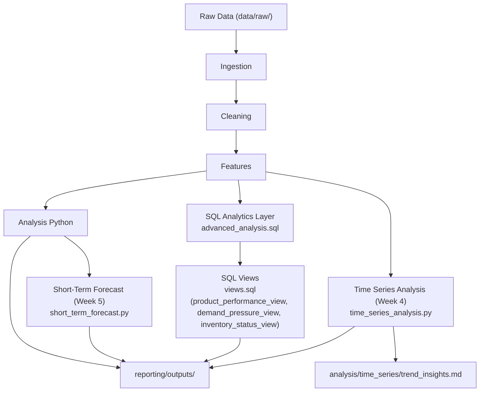

تمام، سأقوم بتحديث الـ README الأساسي ليشمل **اليوم الخامس / الأسبوع الخامس: Short-Term Forecast** مع الحفاظ على كل المراحل السابقة، الهيكل، والمخرجات، بشكل احترافي ودقيق:

---

````markdown
# Decision Support System for Sales & Inventory

نظام دعم قرار للمبيعات والمخزون – الإصدار 2.0 (أسبوع 1 + 2 + 3 + 4 + 5)

## نظرة عامة
نظام يحول البيانات الخام إلى بيانات جاهزة للتحليل، مع دعم قرارات المخزون والتسعير قصيرة المدى.  
- **الأسبوع الرابع** أضاف **تحليل السلاسل الزمنية (Time Series Analysis)** لكل المنتجات، مع استخراج **توصيات لكل منتج** وحفظ **CSV summary** ورسوم بيانية لكل منتج وأيضًا رسم شامل لجميع المنتجات.  
- **الأسبوع الخامس** أضاف **Short-Term Forecast** لتوقع الكميات المستقبلية لمدة 4 أسابيع لكل منتج، مع تقييم الأخطاء لكل توقع، لدعم اتخاذ القرار التشغيلي القصير المدى (تخزين وتسعير).

## هيكل المجلدات
```text
dss_sales_inventory/
│
├─ data/
│   ├─ raw/                  # sales.csv, inventory.csv
│   └─ processed/            # cleaned و features CSVs
│
├─ ingestion/
│   └─ ingestion.py
│
├─ cleaning/
│   └─ cleaning.py
│
├─ features/
│   └─ features.py
│
├─ analysis/
│   ├─ analysis.py
│   ├─ run_sql_layer.py       # SQL analytics layer runner
│   ├─ analytics.db           # SQLite database لتخزين نتائج SQL
│   ├─ forecast/              # الأسبوع الخامس: Short-Term Forecast
│   │   ├─ short_term_forecast.py
│   │   ├─ forecast_results.csv
│   │   ├─ forecast_evaluation.md
│   │   └─ __pycache__/
│   └─ time_series/
│       ├─ time_series_analysis.py   # الأسبوع الرابع: Time Series Analysis
│       ├─ trend_insights.md        # Markdown report
│       └─ __pycache__/
│
├─ reporting/
│   └─ outputs/
│       ├─ product_performance_view.csv
│       ├─ demand_pressure_view.csv
│       ├─ inventory_status_view.csv
│       ├─ time_series_summary.csv    # الأسبوع الرابع
│       ├─ forecast_results.csv      # الأسبوع الخامس
│       └─ plots/
│           ├─ combined_all_products_trend.png
│           ├─ trend_product_XX.png (لكل منتج محدد في التحليل)
│           └─ trend_forecast_product_XX.png (لكل منتج: الأسبوع الخامس)
│
├─ logs/                     # pipeline_{run_id}.log
├─ pipeline.py
└─ README.md
````

## تدفق البيانات (Data Flow)

```text
Raw Data (data/raw/)
│
▼
Ingestion → dict {'sales': df[...], 'inventory': df[...]} (correlation_id)
│
▼
Cleaning → cleaned dict + CSVs
│
▼
Features → featured dict + daily features + CSVs
│
▼
Analysis → summary CSV + plots
│      ├─ Time Series Analysis (أسبوع 4)
│      │   ├─ trend_insights.md
│      │   ├─ time_series_summary.csv
│      │   └─ plots (رسوم لكل منتج + رسم شامل)
│      └─ Short-Term Forecast (أسبوع 5)
│          ├─ forecast_results.csv
│          ├─ forecast_evaluation.md
│          └─ plots (trend_forecast_product_XX.png لكل منتج)
│
▼
SQL Analytics → SQLite (analytics.db) + CSV outputs (Views لحظية)
│
▼
Reporting → جاهزية القرار (Time Series + Forecast)
```



## المتطلبات

* Python 3.9+
* pandas, matplotlib, seaborn, uuid, numpy, sqlite3, statsmodels (لـ Forecast)

## تعليمات التشغيل

1. تأكد من وجود sales.csv و inventory.csv في data/raw/
2. شغل من جذر المشروع: `python pipeline.py`
3. تحقق من logs (يحتوي correlation_id لكل run)
4. بعد التشغيل، النتائج الجديدة موجودة في: `reporting/outputs/`
   **يشمل ذلك:**

   * CSV summary لكل منتج (Time Series: `time_series_summary.csv`)
   * Markdown report (Time Series: `trend_insights.md`)
   * Plots فردية لكل منتج + رسم شامل لجميع المنتجات
   * Forecast Results (Short-Term Forecast: `forecast_results.csv`)
   * Forecast Evaluation report: `forecast_evaluation.md`
   * Plots التنبؤ لكل منتج: `trend_forecast_product_XX.png`

## المراحل والمخرجات

* **Ingestion**: تحميل + dict أولي
* **Cleaning**: تنظيف + referential checks
* **Features**: daily aggregation + stock_ratio
* **Analysis**:

  * إحصاءات + رسوم لكل منتج
  * **Time Series Analysis (أسبوع 4)**:

    * الكشف عن الاتجاه (Trend) لكل منتج: Up / Down / Stable
    * توليد توصية ذكية بناءً على المخزون والطلب
    * حفظ CSV summary + Plots فردية + رسم شامل لجميع المنتجات
  * **Short-Term Forecast (أسبوع 5)**:

    * نموذج تنبؤ قصير المدى (Moving Average / Exponential Smoothing)
    * CSV: `forecast_results.csv` يحتوي على توقعات 4 أسابيع لكل منتج
    * Markdown report: `forecast_evaluation.md` لتقييم الخطأ لكل منتج
    * Plots: `trend_forecast_product_XX.png` لكل منتج
    * هدف: دعم القرارات التشغيلية قصيرة المدى (تخزين وتسعير)
* **SQL Analytics (أسبوع 2 + 3)**:

  * `advanced_analysis.sql`: المنطق الأساسي باستخدام CTEs
  * `views.sql`: إنشاء 3 Views لحظية:

    * **product_performance_view**: متوسط المبيعات اليومية، الإيراد اليومي، performance_score
    * **demand_pressure_view**: نسبة المبيعات اليومية إلى المخزون المتاح، مستوى ضغط الطلب
    * **inventory_status_view**: stock_ratio مقارنة بـ reorder_point، حالة المخزون (safe/risk/critical)

## التوسع المستقبلي

* Power BI dashboard باستخدام CSVs و SQLite db
* ML models في /ml باستخدام daily_quantity_sold و stock_ratio و slope و volatility و forecast كميزات رئيسية للتنبؤ بالطلب وقياس المخاطر

## ملاحظات لمطور جديد

* تمرير dict لتجنب الاعتماديات
* correlation_id لتتبع runs في logs
* كل دالة unit-testable
* SQL layer يستخدم CTEs و subqueries لتحليلات متقدمة
* ملفات CSV القديمة موجودة فقط للتوافق مع الإصدار القديم (يمكن حذفها لاحقًا)
* Time Series Analysis مدمج الآن مع التوصيات لكل منتج وتصدير CSV
* Short-Term Forecast مدمج بعد Time Series، توليد CSV + Markdown + Plots لكل منتج

```

---

```
