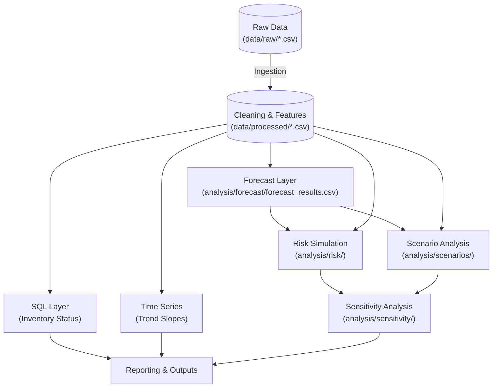

# Decision Support System (DSS): Comprehensive Reference Manual

| **Document Meta** | **Details** |
| --- | --- |
| **Version** | **3.3** (Final Production Release) |
| **Last Updated** | **February 10, 2026** |
| **Status** | **Production Ready** (Modules 1–8 Implemented) |
| **Root Directory** | `C:\Data_Analysis\dss_sales_inventory\` |
| **Target Audience** | Data Engineers, AI Agents, System Architects |

---

## 1. Version History

| Version | Date | Author/System | Description of Changes |
| --- | --- | --- | --- |
| **1.0** | Jan 2026 | Core Team | Initial release (Weeks 1-3: Ingestion, SQL, Descriptive). |
| **2.0** | Jan 2026 | Core Team | Added Predictive Layer (Weeks 4-5: Time Series, Forecasting). |
| **2.4** | Feb 2026 | Core Team | Added Prescriptive Layer (Week 6: Scenarios) and Operational Protocols. |
| **3.0** | Feb 2026 | AI Architect | Enhanced formatting, operational protocols, and formula specifications. |
| **3.1** | Feb 2026 | AI Architect | Added **Risk Simulation Layer (Week 7)** and probabilistic reporting. |
| **3.2** | Feb 2026 | AI Architect | **Synchronization:** Verified paths, QA checklists, and pipeline logic. |
| **3.3** | Feb 2026 | AI Architect | Added **Sensitivity Analysis Layer (Week 8)** including outputs, visualizations, pipeline integration, and QA checklist. |

---

## 2. Executive Summary & Architecture

The Decision Support System (DSS) is a modular analytics engine designed to ingest raw sales and inventory data, process it through a multi-stage pipeline, and deliver actionable insights. The system transitions from **Descriptive Analysis** (historical view) to **Prescriptive Analysis** (strategic simulation), **Probabilistic Risk Assessment**, and finally **Sensitivity Analysis** (robustness testing).

### 2.1 Core Architectural Principles

1. **Dict-Passing Architecture:** State is managed by passing a Python dictionary (`data = {'sales': df, 'inventory': df}`) between functions, ensuring statelessness and high testability.
2. **Traceability:** A unique `correlation_id` (UUID) is generated at the pipeline's initialization and propagated through every log entry and transformation step (See **Section 6.1** for Logging Standards).
3. **Immutability:** Raw data in `data/raw` is read-only. All transformations result in new artifacts stored in `data/processed` or `analysis/`.
4. **Modularity:** Each analytical stage (SQL, Time Series, Forecast, Scenarios, Risk, Sensitivity) functions as an independent unit, executable via the main orchestrator or standalone for debugging.

### 2.2 Project Directory Tree

The project follows a strict hierarchical structure.

```text
C:\DATA_ANALYSIS\DSS_SALES_INVENTORY
|   pipeline.py                     # [Entry Point] Main orchestrator
|   README.md
|
+---analysis
|   |   analysis.py
|   |   analytics.db                # SQLite Database
|   |   run_sql_layer.py
|   |
|   +---forecast
|   |       forecast_evaluation.md
|   |       forecast_results.csv    # [Week 5 Output]
|   |       short_term_forecast.py
|   |
|   +---risk
|   |       product_risk_scores.csv # [Week 7 Output]
|   |       risk_assessment_report.md
|   |       risk_simulation.py
|   |
|   +---scenarios
|   |       scenarios_comparison.xlsx
|   |       scenario_analysis.py
|   |       scenario_insights.md
|   |
|   +---sensitivity
|   |   |   sensitivity_analysis.py
|   |   |   sensitivity_findings.md
|   |   |
|   |   \---outputs
|   |           sensitivity_heatmap.png
|   |           sensitivity_spider.png
|   |           sensitivity_tornado.png
|   |
|   +---sql
|   |       advanced_analysis.sql
|   |       views.sql
|   |
|   +---time_series
|   |       time_series_analysis.py
|   |       trend_insights.md
|
+---cleaning
|       cleaning.py
|
+---data
|   +---processed                   # Cleaned Intermediate Files
|   |       inventory_cleaned.csv
|   |       inventory_features.csv
|   |       sales_cleaned.csv
|   |       sales_features.csv
|   |
|   \---raw                         # Immutable Inputs
|           inventory.csv
|           sales.csv
|
+---features
|       features.py
|
+---ingestion
|       ingestion.py
|
\---reporting
    \---outputs
        |   analysis_summary.csv
        |   inventory_status_view.csv
        |
        \---plots                   # Visualization Images
                trend_daily_revenue.png
                combined_all_products_trend.png

```

---

## 3. Data Flow & Pipeline Sequence

### 3.1 Pipeline Execution Logic

The data journey follows a directed dependency graph.



1. **Ingestion & Cleaning:** Loads raw CSVs, sanitizes types, and fills nulls.
2. **Feature Engineering:** Merges sales and inventory to create the foundational `inventory_features.csv`.
3. **Analytical Branching:** Data flows in parallel to:
* **SQL Layer:** For operational status views.
* **Time Series:** For historical trend detection.
* **Forecast:** For future demand prediction (saved to `analysis/forecast/`).


4. **Strategic Layer:**
* **Scenarios:** Uses Forecasts + Features to simulate market conditions.
* **Risk (Week 7):** Uses Forecasts + Features to run Monte Carlo simulations for probability scoring.
* **Sensitivity (Week 8):** Perturbs inputs from Scenarios and Risk to test model robustness and identify key drivers.


### 3.2 Module Summary Table

| Module | Primary Script | Core Functions | Inputs | Outputs |
| --- | --- | --- | --- | --- |
| **Ingestion** | `ingestion.py` | `load_csv_safely` | Raw CSVs | Pandas DataFrames |
| **Cleaning** | `cleaning.py` | `clean_data` | Raw DataFrames | `sales_cleaned.csv` |
| **Features** | `features.py` | `merge_data` | Cleaned DataFrames | `inventory_features.csv` |
| **SQL Layer** | `run_sql_layer.py` | `export_view` | Feature Data | `inventory_status_view.csv` |
| **Time Series** | `time_series_analysis.py` | `detect_trend` | Daily Sales | `trend_insights.md` |
| **Forecast** | `short_term_forecast.py` | `predict_demand` | Time Series Data | `analysis/forecast/forecast_results.csv` |
| **Scenarios** | `scenario_analysis.py` | `simulate_scenario` | Forecasts, Inventory | `scenarios_comparison.xlsx` |
| **Risk (Week 7)** | `risk_simulation.py` | `run_monte_carlo` | `forecast_results.csv`<br>

<br>`inventory_features.csv` | `product_risk_scores.csv`<br>

<br>`risk_assessment_report.md` |
| **Sensitivity (Week 8)** | `sensitivity_analysis.py` | `run_sensitivity_analysis` | `data dict` containing sales, inventory, scenarios, risk | `data["sensitivity_results"]`, `data["sensitivity_ranking"]`, `sensitivity_findings.md`, `outputs/sensitivity_*.png` |

---

## 4. Technical Specifications & Formulas

### 4.1 Data Dictionary

| Field Name | Type | Origin | Description |
| --- | --- | --- | --- |
| `product_id` | `int` | Raw | Unique identifier for products. |
| `transaction_date` | `date` | Raw | Date of sale or inventory snapshot. |
| `quantity` | `int` | Raw | Units sold or held in stock (Must be >= 0). |
| `stock_ratio` | `float` | Features | Ratio of current inventory to daily sales average. |
| `trend_slope` | `float` | Time Series | Rate of change in sales (Linear Regression slope). |
| `forecast_quantity` | `float` | Forecast | Predicted sales volume for a specific future date. |
| `risk_score` | `float` | Risk | Normalized score (0.0–1.0) indicating stockout probability. |
| `var_95` | `float` | Risk | **Value at Risk (95%)**: Worst-case profit loss threshold. |
| `sensitivity_results` | `DataFrame` | Sensitivity Layer | Delta metrics per input variable (OAT perturbation). |
| `sensitivity_ranking` | `Series` | Sensitivity Layer | Normalized sensitivity score per variable. |

### 4.2 Master Formulas Table

| Metric | Formula Logic | Step-by-Step Numerical Example |
| --- | --- | --- |
| **Stock Ratio** | `Inventory / Avg_Daily_Sales` | **Given:** Inventory = 500 units, Avg Daily Sales = 25 units.<br>

<br>**Calc:** `500 / 25`.<br>

<br>**Result:** **20.0** (Days of Inventory Cover). |
| **Trend Slope** | Linear Regression (`y = mx + c`).<br>

<br>`m` represents the slope. | **Given:** Sales over 3 days = [100, 105, 110].<br>

<br>**Calc:** Rise (10) / Run (2 days) = 5.<br>

<br>**Result:** **+5.0** (Strong Uptrend). |
| **Projected Sales** | `Min(Forecast, Stock)` | **Given:** Forecast Demand = 120, Available Stock = 100.<br>

<br>**Calc:** `Min(120, 100)`.<br>

<br>**Result:** **100** units (Lost sales = 20). |
| **Remaining Stock** | `Stock + Supply - Sales` | **Given:** Stock = 100, Supply Added = 50, Sales = 100.<br>

<br>**Calc:** `100 + 50 - 100`.<br>

<br>**Result:** **50** units remaining. |
| **Expected Profit** | `(Price - Cost) * Sales - Holding_Cost` | **Given:** Sold=100, Price=$20, Cost=$10, Holding=$50.<br>

<br>**Calc:** `(10*100) - 50`.<br>

<br>**Result:** **$950**. |

---

## 5. Detailed Module Implementation & QA Checklists

### 5.1 Ingestion & Cleaning (Week 1)

* **Goal:** Ensure data hygiene.
* **QA Checklist:**
* [ ] **File Existence:** `data/raw/sales.csv` and `data/raw/inventory.csv` are present.
* [ ] **Schema Check:** `product_id` is Integer, `date` is ISO-8601 format.
* [ ] **Data Integrity:** No negative values in `quantity` or `price`.
* [ ] **Null Handling:** Confirm `fillna(0)` executed on numerical columns.


### 5.2 SQL Decision Layer (Weeks 2-3)

* **Goal:** Operational reporting.
* **QA Checklist:**
* [ ] **View Generation:** `inventory_status_view.csv` created.
* [ ] **Logic Verification:** Verify `stock_status` logic (e.g., if Stock=0, Status='Out of Stock').
* [ ] **Row Count:** Matches unique `product_id` count from input.


### 5.3 Time Series Analysis (Week 4)

* **Goal:** Trend detection.
* **QA Checklist:**
* [ ] **Plot Generation:** `reporting/plots/` contains `.png` files.
* [ ] **Insight Generation:** `trend_insights.md` is not empty.
* [ ] **Value Check:** Slope values are within reasonable bounds (e.g., -100 to 100).


### 5.4 Short-Term Forecast (Week 5)

* **Goal:** 28-day demand prediction.
* **QA Checklist:**
* [ ] **File Path:** Output exists at `analysis/forecast/forecast_results.csv`.
* [ ] **Completeness:** 28 rows per product.
* [ ] **Sanity Check:** No negative forecasts (`forecast_quantity >= 0`).
* [ ] **Evaluation:** `forecast_evaluation.md` contains MAE scores.


### 5.5 Scenario Analysis (Week 6)

* **Goal:** "What-if" simulations.
* **QA Checklist:**
* [ ] **Input Validation:** Successfully loads `analysis/forecast/forecast_results.csv`.
* [ ] **Calculation:** `expected_profit` varies between Scenarios (Optimistic vs Pessimistic).
* [ ] **Formatting:** `scenarios_comparison.xlsx` is readable by Excel.


### 5.6 Probabilistic Risk Simulation (Week 7)

* **Goal:** Monte Carlo simulation for risk scoring.
* **Script:** `analysis/risk/risk_simulation.py`
* **Inputs:** * `analysis/forecast/forecast_results.csv`
* `data/processed/inventory_features.csv`


* **Outputs:** * `analysis/risk/product_risk_scores.csv`
* `analysis/risk/risk_assessment_report.md`


* **QA Checklist:**
* [ ] **Execution:** Script runs without `FileNotFoundError`.
* [ ] **Metrics:** `var_95` is calculated for all items.
* [ ] **Range Check:** `risk_score` is normalized between 0.0 and 1.0.
* [ ] **Reporting:** Markdown report correctly identifies High Risk products.


### 5.7 Sensitivity Analysis (Week 8)

* **Goal:** Evaluate model robustness by perturbing input variables (OAT ±20%) to determine sensitivity of KPIs (Expected Profit, Remaining Stock, Total Revenue).
* **Inputs:** `data dict` with `sales`, `inventory`, `scenarios`, risk scores from Week 7.
* **Outputs:**
* `data["sensitivity_results"]` → DataFrame with delta metrics per variable
* `data["sensitivity_ranking"]` → normalized sensitivity scores
* `sensitivity_findings.md` → Executive Summary + Impact Ranking + Technical Notes
* `outputs/sensitivity_tornado.png`, `outputs/sensitivity_spider.png`, `outputs/sensitivity_heatmap.png`


* **QA Checklist:**
* [ ] **Script executes without errors**
* [ ] **Sensitivity scores are normalized (0–1)**
* [ ] **Tornado, Radar, and Heatmap images are generated**
* [ ] **Markdown report contains baseline KPIs, top drivers, and key risks**


---

## 6. Operational Protocols

### 6.1 Logging Standards

* **Pattern:** `%(asctime)s - %(levelname)s - [Correlation ID] - %(message)s`
* **Mandate:** Every function entry/exit and exception must be logged with the ID.

### 6.2 Error Taxonomy

| Exception | Severity | Trigger | Resolution Action |
| --- | --- | --- | --- |
| `FileNotFoundError` | **Critical** | Missing input CSVs. | Check `data/raw` or previous pipeline steps. |
| `ValidationError` | **Critical** | Schema mismatch/Bad types. | Reject source data; clean manually. |
| `InsufficientDataError` | **Warning** | History < 14 days. | Log warning, skip product, continue. |
| `MissingForecastDataError` | **Critical** | Missing `forecast_results.csv`. | Run `short_term_forecast.py` first. |

---

## 7. Extensibility Guide

### 7.1 Adding Machine Learning (Week 9+)

1. Create `analysis/ml_model/predictive_model.py`.
2. Inputs: `inventory_features.csv` + `forecast_results.csv`.
3. Integration: Call in `pipeline.py` after `run_risk_simulation`.

### 7.2 Modifying Risk Parameters

1. Open `analysis/risk/risk_simulation.py`.
2. Adjust `define_distributions()` to change standard deviation assumptions (e.g., increase `demand_std` for volatile markets).

---

*End of Comprehensive Reference Manual v3.3*
